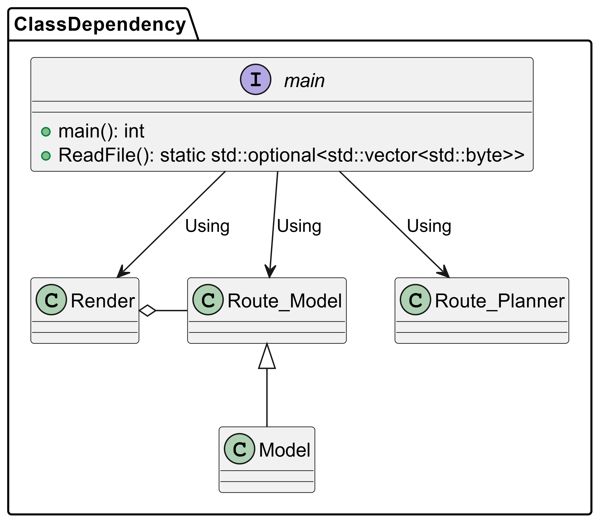
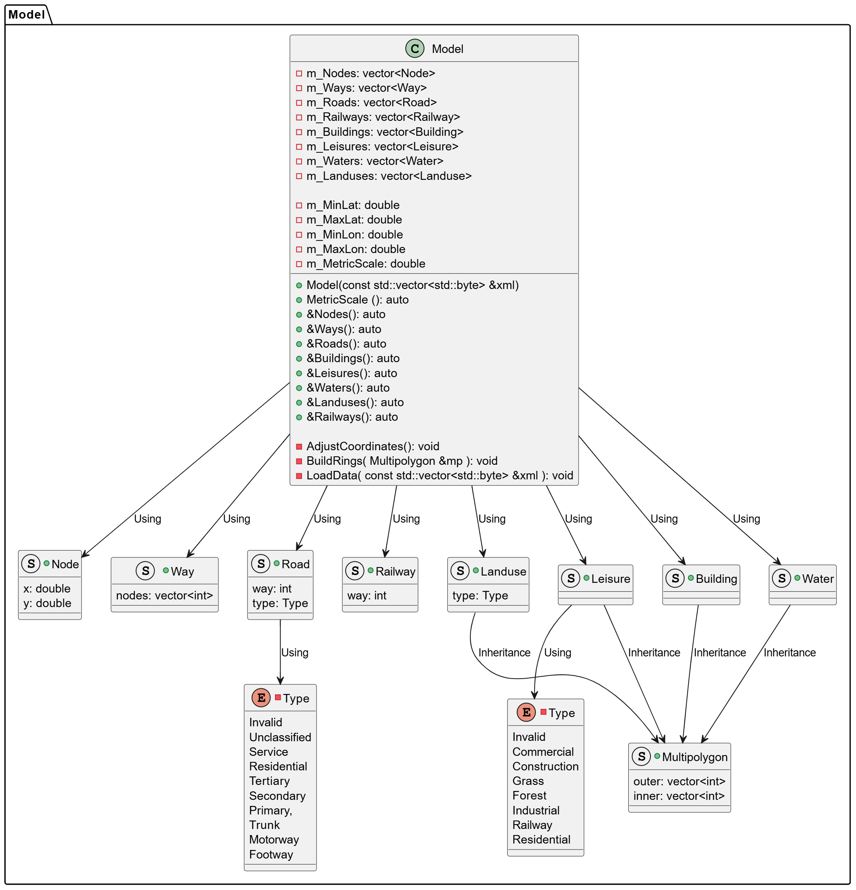
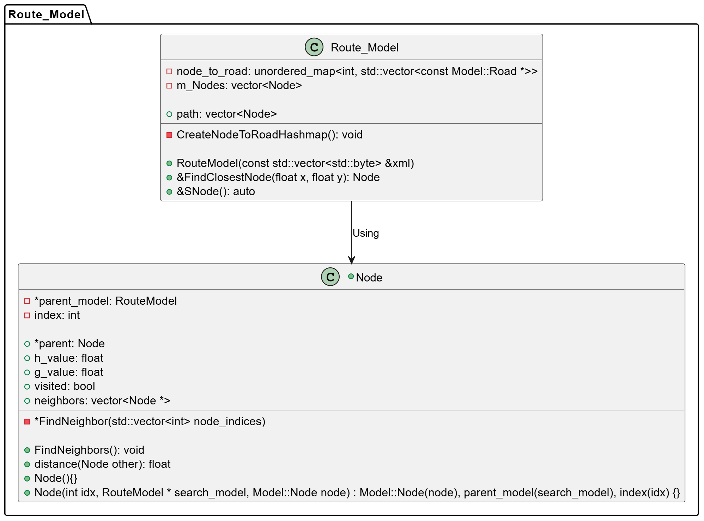
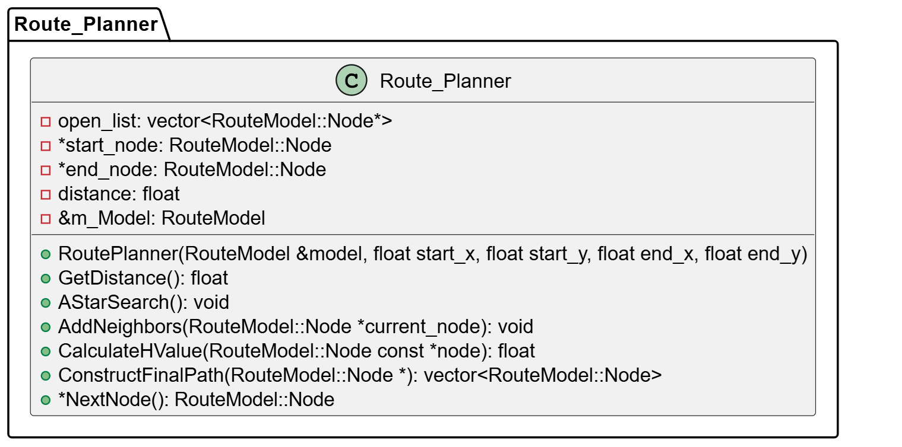
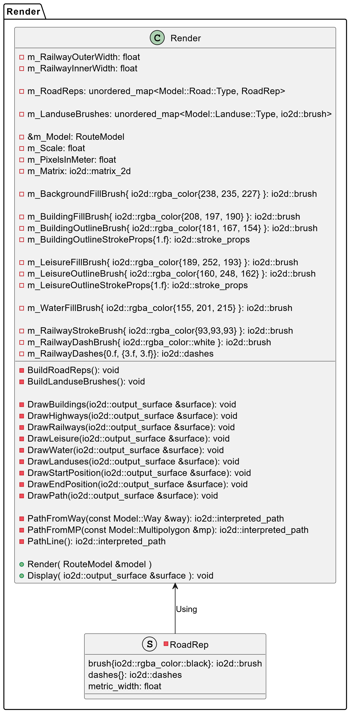

# OpenStreetMap Route Planner Implementation (Design)

## I. Class diagram

### &emsp;1.1. Class dependency 

| **Class name** | **Detail information** | **Reference** |
| :--- | :--- | :--- |
| `model` | Store and manage OpenStreetMap including nodes, roads, rail lines and polygons |  [REF](#1.2) |
| `route_model` | Inherits from `Model`, adding the properties and methods needed to perform a specific route search | [REF](#1.3) |
| `route_planner` | Store all the logic of A*search and its supporting functions | [REF](#1.4) |
| `render` | Stores all logic about interface presentation | [REF](#1.5) |

### &emsp;1.2. Class `model` 

| **Class attributes** | **Detail information** |
| :--- | :--- |
| m_Nodes | Stores all the coordinate points (Nodes) of the map |
| m_Ways | Stores all the waypoints (Ways) of the map |
| m_Roads | Store all road objects |
| m_Railways | Stores all railway objects |
| m_Buildings | Stores all building objects |
| m_Leisures | Stores all recreation objects |
| m_Waters | Stores all water area objects |
| m_Landuses | Stores all land use objects |
| m_MinLat | Stores minimum latitude of map area before normalization |
| m_MaxLat | Stores maximum latitude of map area before normalization |
| m_MinLon | Stores minimum longitude of map area before normalization |
| m_MaxLon | Stores maximum longitude of map area before normalization |
| m_MetricScale | Stores scale factor used to normalize coordinates, represents the length (in meters) |

| **Class methods** | **Detail information** | **Activity Diagram** |
| :--- | :--- | :--- |
| Model | Initialize the map model by receiving raw OSM data (as XML) and loading/processing that data | [REF](...) |
| MetricScale | Returns the value of `m_MetricScale`, which converts the normalized distance back to meters | [REF](...) |
| Nodes | Returns a reference to a vector containing all the `Nodes` | [REF](...) |
| Ways | Returns a reference to a vector containing all `Ways` | [REF](...) |
| Roads | Returns a reference to a vector containing all `Roads` | [REF](...) |
| Buildings | Returns a reference to a vector containing all `Buildings` | [REF](...) |
| Leisures | Returns a reference to a vector containing all `Leisures` | [REF](...) |
| Waters | Returns a reference to a vector containing all `Waters` | [REF](...) |
| Landuses | Returns a reference to a vector containing all `Landuses` | [REF](...) |
| Railways | Returns a reference to a vector containing all `Railways` | [REF](...) |
| AdjustCoordinates | Adjust and normalize raw OSM latitude/longitude coordinates to metric x and y coordinates and bring them to a normalized range (0.0 to 1.0) based on `m_MetricScale` | [REF](...) |
| BuildRings | Handles `Multipolygons` defined by non-closed or segmented `Ways` | [REF](...) |
| LoadData | Parses raw OSM (XML) data and fills all member vectors with data | [REF](...) |

### &emsp;1.3. Class `route_model` 

##### Class `Node`

| **Class attributes** | **Detail information** |
| :--- | :--- |
| parent | Used to track and reconstruct the final path in an A* search |
| h_value | Stores the cost from the current Node to the destination Node |
| g_value | Stores the cost from the start Node to the current Node |
| visited | Signals whether this Node has been visited during the A* search |
| neighbors | Stores a list of neighboring Nodes that can be reached from the current Node |
| index | Helps identify and access a specific point on the map |
| parent_model | Is a global map that each Node can refer to for information about its surroundings (paths, other Nodes, etc.) |

| **Class methods** | **Detail information** | **Activity Diagram** |
| :--- | :--- | :--- |
| Distance | Returns the normalized distance (from 0.0 to 1.0) on the map adjusted through distance calculation | [REF](...) |
| FindNeighbors | Find all reachable neighboring Nodes from the current Node using `parent_model` and `node_to_road` to identify Nodes linked by valid Roads | [REF](...) |
| Node | Initialize a `Node` and set default values ​​for A* and associate it with the parent `RouteModel` and `index` | [REF](...) |
| FindNeighbor | Helper function `FindNeighbors` takes a list of Node indices that make up a path and finds which `Node` in that list is a valid, nearest, and unvisited neighbor | [REF](...) |

##### Class `Route_Model`

| **Class attributes** | **Detail information** |
| :--- | :--- |
| path | Stores the final path (sequence of Nodes) found by `RoutePlanner` after the A* algorithm completes |
| m_Nodes | Stores all Nodes created for route lookup |
| node_to_road | Used to determine available paths from a Node |

| **Class methods** | **Detail information** | **Activity Diagram** |
| :--- | :--- | :--- |
| RouteModel | create all corresponding `RouteModel::Node` and build `node_to_road` hashmap by get the map XML data | [REF](...) |
| FindClosestNode | Finds and returns a reference to the Node closest to the given normalized (x, y) coordinates on the map | [REF](...) |
| SNodes | Returns a reference to the `m_Nodes` vector containing the `RouteModel::Node` | [REF](...) |
| CreateNodeToRoadHashmap | Build hashmap `node_to_road` | [REF](...) |

### &emsp;1.4. Class `route_planner` 

| **Class attributes** | **Detail information** |
| :--- | :--- |
| ... | ... |
| ... | ... |

| **Class methods** | **Detail information** | **Activity Diagram** |
| :--- | :--- | :--- |
| ... | ... | [REF](...) |
| ... | ... | [REF](...) |

### &emsp;1.5. Class `render` 

| **Class attributes** | **Detail information** |
| :--- | :--- |
| ... | ... |
| ... | ... |

| **Class methods** | **Detail information** | **Activity Diagram** |
| :--- | :--- | :--- |
| ... | ... | [REF](...) |
| ... | ... | [REF](...) |

## II. Sequence diagram
