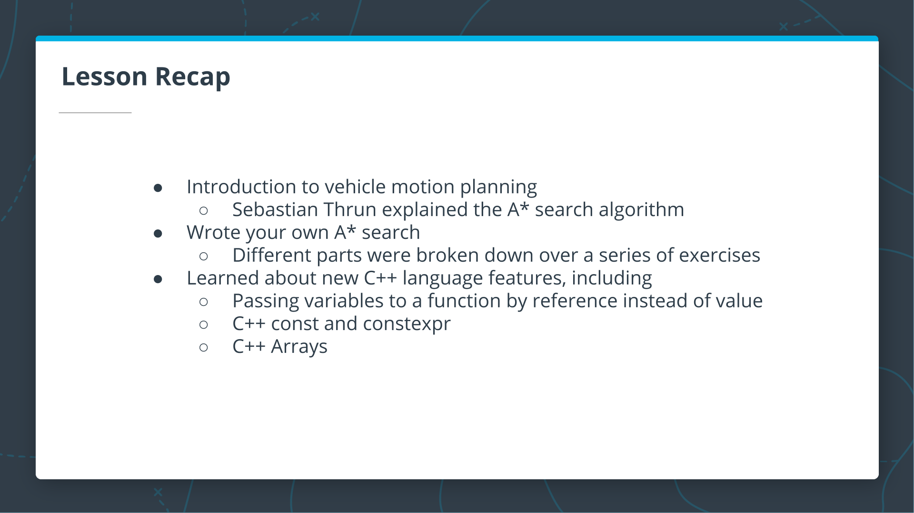
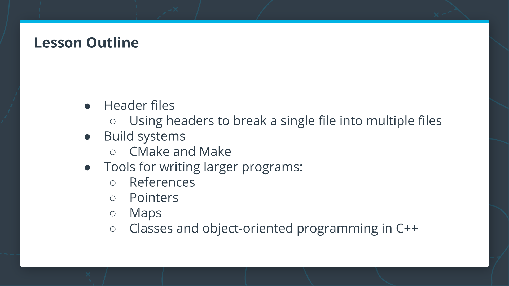
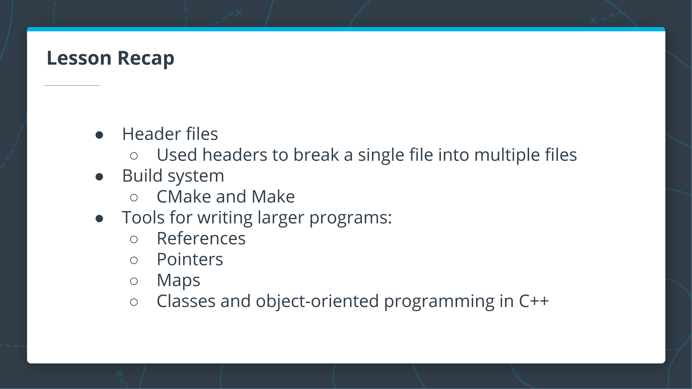
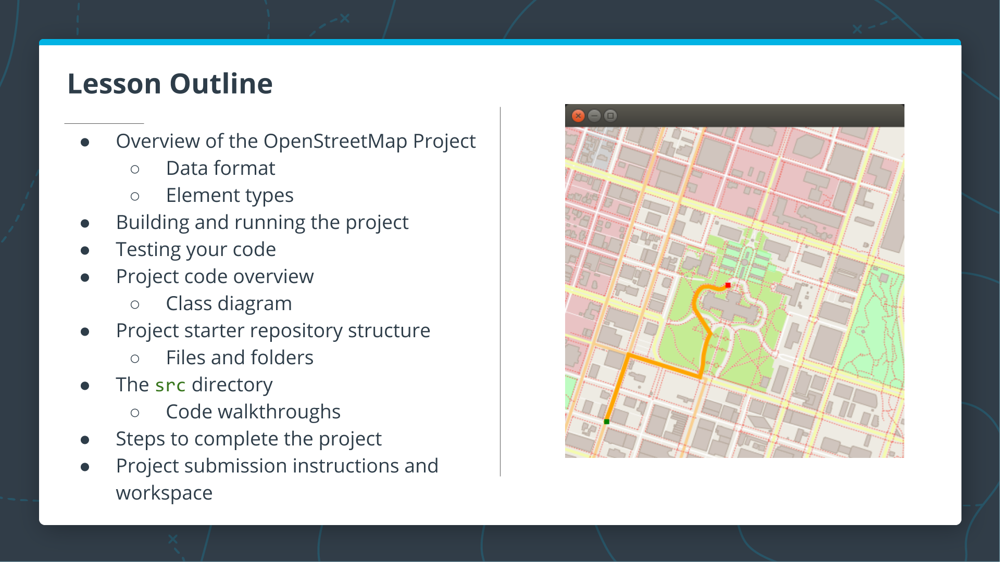
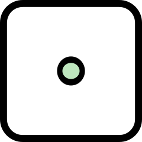
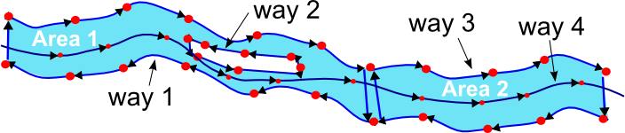
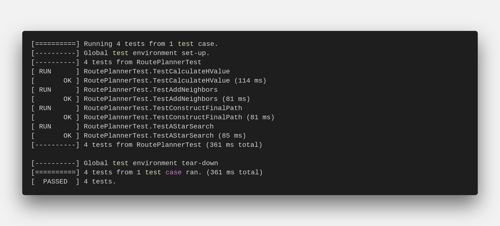

# 1. Welcome

[Welcome to C++ Foudations](https://www.youtube.com/watch?v=PbiTuU2sm08)


[What is C++?](https://youtu.be/tXg6TiANbA4)

[Why Learn C++?](https://youtu.be/5YqXKix5iwM)

[What's Different About C++?](https://youtu.be/qUNRDSeM4uA)

[Where is C++ Used?](https://youtu.be/mosm1Orkn_U)

[Why Is C++ the Choice for Industry?](https://youtu.be/w6NXX9JyBhM)

# 2. Introduction to the C++ Langauge

[Lesson Outline](https://youtu.be/AMXGJ68Tng4)


C++ is a compiled language; there is a separate program - the compiler - that converts your code to an executable program that the computer can run. This means that running a new C++ program is normally a two step process:
- Compile your code with a compiler.
- Run the executable file that the compiler outputs.

## Compiled Languages vs Scripted Languages

we might be wondering why one might use a compiled language. What are the advantages and disadvantages?
In the next couple of videos, Bjarne compares compiled and scripted languages and discusses some of the advantages and disadvantages of each:
+ [Advantages and Disadvantages of Compiled Languages](https://youtu.be/lLdYFFIyc60)
+ [Advantages of a Dynamically Scripted Language](https://youtu.be/DedCGNJAZQY)

## C++ Output and Language Basics

[C++ Output and Language Basics](./Notebook/C++%20Output%20and%20Language%20Basics.ipynb)

## C++ Types Introduction

C++ uses variables, just as in nearly every other programming language. Unlike some other languages, however, in C++ each variable has a fixed type. When a new variable is "declared", or introduced in a program, the program author must (usually) specify the variable type in the declaration.

[C++ Types Introduction](https://youtu.be/2tuTBl584ow)

[Primitive Variable Types](./Notebook/Primitive%20Variable%20Types.ipynb)

[What is a Vector?](https://youtu.be/AfwagT0JJO0)

[How to declare and store a vector containing primitive types](./Notebook/C++%20Vectors.ipynb)

we have now seen how to store basic types and vectors containing those types. As we practiced declaring variables, in each case we indicated the type of the variable. It is possible for C++ to do automatic type inference, using the `auto` keyword.

[Using `Auto`](./Notebook/Using%20Auto.ipynb)


> **CODE: Store a Grid in Your Program**\
> In order to write the A* search algorithm, we will need a grid or "board" to search through. We'll be working with this board throughout the remaining exercises, and we'll start by storing a hard-coded board in the main function. In later exercises, we will write code to read the board from a file.
> \
> **To Complete This Exercise**: In the `main` function, declare a variable board as a vector of vectors of ints: `vector<vector<int>>`.\
> [Solution](./Notebook/Store%20a%20Grid%20in%20Your%20Program.cpp)

[Working with Vectors](./Notebook/Working%20with%20Vectors.ipynb)

[For Loops](./Notebook/For%20Loops.ipynb)

[Functions](./Notebook/Functions.ipynb)

> **CODE: Print the Board**\
> Now that we have a board stored in your program, we'll need a way to print it out so we can display the results of your project. In this exercise, we will add a `PrintBoard` function to print the board one row at a time.\
> **_To Complete This Exercise_**: Write a void `PrintBoard` function. The function should accept the board as an argument. The function should print each row of the board with a newline `"\n"`.\
> [Solution](./Notebook/Print%20the%20Board.cpp)

Now that we are able to print the board in your program, we will make the program more flexible by reading the board from a file. This will allow we to run your program with different board files to see the results.

Before we can read the contents of a file into your program, we'll need to learn the syntax for just a couple more parts of the C++ language: `if` statements and `while` loops.

[If Statements and While Loops](./Notebook/If%20Statements%20and%20While%20Loops.ipynb)

[Reading from a File](./Notebook/Reading%20from%20a%20File.ipynb)

> **CODE: Read the Board from a File**\
> Until now, the board has been declared and initialized in the `main()` function. As discussed in the previous notebook, we will need a function to read the board in from another file in order to make the program a little more flexible and user-friendly.\
> The first step in this process will be to write a `ReadBoardFile` function that reads in the file and prints each line to `cout`. The output should look like the [`1.board`](./Notebook/1.board) file\
> **_To Complete This Exercise_**: Write a function void `ReadBoardFile` which reads lines from a file. Write each line to `cout`, followed by a newline character `"\n"`. The function should accept a string argument, which represents the path to the file. For now, since `ReadBoardFile` does not need to return anything, we can use a `void` return type.\
> **_Note_**: we will need to include the `fstream` class, and we may want to have `using std::ifstream` to use the `ifstream` object without having to write `std::` in the rest of your code.\
> [Solution](./Notebook/Read%20the%20Board%20from%20a%20File.cpp)

Now that the board is being read into your program line by line, we will want to process each line and store the data, rather than just streaming it to `cout`. There are many ways to do this in C++, but we will focus on `istringstream` from the `<sstream>` header file.

[Processing Strings](./Notebook/Processing%20Strings.ipynb)

[Adding Data to a Vector](./Notebook/Adding%20Data%20to%20a%20Vector.ipynb)

> **CODE: Parse Lines from the File**\
> Now that we are able to read a board line by line from a file, we will want to parse these lines and store them in a `vector<int>`. In this exercise, we will focus on a helper function to do this string parsing.\
> **_To Complete This Exercise_**: Write a `vector<int> ParseLine` function which accepts a string as an argument. Use `std::istringstream` to parse the line by comma `char`s, and store the `int`s in a `vector<int>`. `ParseLine` should return the vector after parsing.\
> **_Note_**: we will need to `#include <sstream>` to use `istringstream`. Additionally, we may want to add using std::istringstream; to your program. Finally, remember that each line of the board will look something like: `1,0,0,0,0,`, so we may want to stream an `int` and a `char` with each pass through a while loop.\
> [Solution](./Notebook/Parse%20Lines%20from%20the%20File.cpp)

> **CODE: Use the ParseLine Function**\
> With the `ParseLine` function complete, we can now use it in the `ReadBoardFile` to process each line of the incoming file. In this exercise, we will do just that: follow the TODOs in the code below, updating both `ReadBoardFile` and the `main` function to finish the processing of an external board file.\
> **_To Complete This Exercise_**: Update `ReadBoardFile` to use `ParseLine` and return the board as a `vector<vector<int>>`. we can read the TODO comments in the code for step by step instructions.\
> [Solution](./Notebook/Use%20the%20ParseLine%20Function.cpp)

In the previous exercises, we stored and printed the board as a vector<vector<int>>, where only two states were used for each cell: 0 and 1. This is a great way to get started, but as the program becomes more complicated, there will be more than two possible states for each cell. Additionally, it would be nice to print the board in a way that clearly indicates open areas and obstacles, just as the board is printed below.


To do this clearly in your code, we will learn about and use something called an `enum`. An `enum`, short for enumerator, is a way to define a type in C++ with values that are restricted to a fixed range. For an explanation and examples, see the notebook below:
- [Formatting the Printed Board](./Notebook/Formatting%20the%20Printed%20Board.ipynb)

> **CODE: Formatting the Printed Board**\
> The board will eventually have more than two cell states as the program becomes more complicated, and it would be nice to add formatting to the printed output of the board to ensure readability as the number of board states increases.\
> To accommodate more board states and facilitate print formatting, we have provided the `State` enum with enumerator values `kEmpty` and `kObstacle`. In this exercise, we will write a `CellString` function which converts each `State` to an appropriate string. In the next exercise, we will update the program to use the `enum` values and `CellString` function.
> **_To Complete This Exercise_**: Write a function CellString which accepts aState as input and returns the following string:
> - `"⛰️ "`if the input equals a `kObstacle`
> - `"0 "` otherwise.
>
> [Solution](./Notebook/Formatting%20the%20Printed%20Board.cpp)

> **CODE: Store the Board using the State Enum**\
> Now that we have a way to print the `State` `enum` values, we will be able to modify your program to use `State` values in the board exclusively. To do this, we will need to modify the return types and variable types in several places of the code. Don't worry, as we have clearly marked these with a `TODO` in each part of the code.\
> **_To Complete This Exercise_**: Follow the `TODO` comments in the `main` file below, and update the program to store a board of `State` variables. When we are done, the board should print as in the image above. Note that we will need to call `CellString` on each object in the board before printing: `CellString(board[i][j])`.\
> [Solution](./Notebook/Store%20the%20Board%20using%20the%20State%20Enum.cpp)

## Lesson Recap

[Lesson Recap](https://youtu.be/8pdt3E4wsCU)

We now have a C++ program which reads board data, stores the board in your program, and prints the board with nice formatting. we are ready to begin writing the A* search function.


At this point, our program should look like the program below. We have built this short program from scratch, so now is great time to review the code to ensure we recall how each part of it works.

> ```C++
> #include <fstream>
> #include <iostream>
> #include <sstream>
> #include <string>
> #include <vector>
> using std::cout;
> using std::ifstream;
> using std::istringstream;
> using std::string;
> using std::vector;
> 
> enum class State {kEmpty, kObstacle};
> 
> vector<State> ParseLine(string line) {
>     istringstream sline(line);
>     int n;
>     char c;
>     vector<State> row;
>     while (sline >> n >> c && c == ',') {
>       if (n == 0) {
>         row.push_back(State::kEmpty);
>       } else {
>         row.push_back(State::kObstacle);
>       }
>     }
>     return row;
> }
> 
> vector<vector<State>> ReadBoardFile(string path) {
>   ifstream myfile (path);
>   vector<vector<State>> board{};
>   if (myfile) {
>     string line;
>     while (getline(myfile, line)) {
>       vector<State> row = ParseLine(line);
>       board.push_back(row);
>     }
>   }
>   return board;
> }
> 
> string CellString(State cell) {
>   switch(cell) {
>     case State::kObstacle: return "⛰️   ";
>     default: return "0   "; 
>   }
> }
> 
> void PrintBoard(const vector<vector<State>> board) {
>   for (int i = 0; i < board.size(); i++) {
>     for (int j = 0; j < board[i].size(); j++) {
>       cout << CellString(board[i][j]);
>     }
>     cout << "\n";
>   }
> }
> 
> int main() {
>   auto board = ReadBoardFile("1.board");
>   PrintBoard(board);
> }
> ```

# 3. A* Search

[Lesson Outline](https://youtu.be/XlEVpwKHkMY)


[Motion Planning Concept](https://youtu.be/KHAu5A_flcQ)

[Coding the Shortest Path Algorithm](https://youtu.be/pqJTVPls-k0)

[A* Search Overview](https://youtu.be/lxCCtgHk5Vs)

The `A* search` algorithm finds a path from the start node to the end node by checking for open neighbors of the current node, computing a heuristic for each of the neighbors, and adding those neighbors to the list of open nodes to explore next. The next node to explore is the one with the lowest total cost + heuristic (g + h). This process is repeated until the end is found, as long as there are still open nodes to explore.

This algorithm described by Sebastian is very similar to other search algorithms we may have seen before, such as `breadth-first search`, except for the additional step of computing a heuristic and using that heuristic (in addition to the cost) to find the next node.

The following is the pseudocode for the algorithm described in the video above. Although the pseudocode shows the complete algorithm in a single function, we will split parts of the algorithm into separate functions in this lesson so we can implement them step-by-step in a sequence of exercises:

> **`Search`**( _grid, initial_point, goal_point_ ):
> 1.  Initialize an empty list of **open nodes**.
> 2.  Initialize a starting node with the following:\
>     _x and y values given_ by initial_point*.
>     * **g_value** = 0, where g is the cost for each move.
>     * **h_value** given by the heuristic function (a function of the current coordinates and the goal).
> 3.  Add the new node to the list of open nodes.
> 4.  **while** the list of open nodes is nonempty:\
>     a. Sort the open list by **f_value**, which is equal to the summation of the **g_value** and the **h_value**.\
>     b. Pop the optimal cell (called the _current_ cell).\
>     c. Mark the cell's coordinates in the grid as part of the path.\
>     d. **if** the _current_ cell is the goal cell:\
>     &emsp;_return the_ grid*.\
>     e. **else**, expand the search to the _current_ node's neighbors. This includes the following steps:\
>     &emsp;_Check each neighbor cell in the_ grid* to ensure that the cell is empty: it hasn't been closed and is not an obstacle.\
>     &emsp; if the cell is empty, compute the cost (**g_value**) and the heuristic, and add to the list of open nodes.
>       * Mark the cell as closed.
> 5.  If you exit the while loop because the list of open nodes is empty, you have run out of new nodes to explore and haven't found a path.

[A* Code Structure](https://youtu.be/ItIdjPEhHdg)

The code for the A* search algorithm has been broken down into the following functions:
- `CellSort()` - sorts the open list according to the sum of h + g
- `ExpandNeighbors()` - loops through the current node's neighbors and calls appropriate functions to add neighbors to the open list
- `CheckValidCell()` - ensures that the potential neighbor coordinates are on the grid and that the cell is open
- `Heuristic()` - computes the distance to the goal
- `AddToOpen()` - adds the node to the open list and marks the grid cell as closed

we will be implementing these functions along with a few other small helper functions throughout the rest of this lesson to complete the ASCII A* search program.


## Starting A\* Search

> **CODE: Starting A\* Search**
>
> To get started with writing the A* search algorithm, we will first add a `Search` function stub that accepts and returns the appropriate variable types.
>
> **_To Complete This Exercise_**:
> 1. Write a `std::vector<vector<State>>` Search function stub which takes a board grid and two arrays of size 2 as arguments. The int arrays will represent the start and goal coordinates for the search. The function should print ""No path found!" and return an empty `std::vector<vector<State>>`. The function will later return the board with a path from the start to the goal.\
> 2. In `main()`, call `Search` with a start of `{0, 0}` and a goal of `{4, 5}`. Store the results in the variable `solution`.\
> 3. Pass `solution` to `PrintBoard`.
>
> [Solution](./Notebook/Starting%20Astar%20Search.cpp)

## Writing the A* Heuristic

[Writing the A* Heuristic](https://youtu.be/yJR9fPRDKfU)

> **CODE: Writing the A\* Heuristic**\
> In this section, we will write a Heuristic function that will be used to guide the A* search. In general, any [admissible function](https://en.wikipedia.org/wiki/Admissible_heuristic) can be used for the heuristic, but for this project, we will write one that takes a pair of 2D coordinates on the grid and returns the [Manhattan Distance](https://en.wikipedia.org/wiki/Taxicab_geometry) from one coordinate to the other\
> &emsp;Write an `int Heuristic` function which takes four `int`s as arguments. The `int`s represent two pairs of 2D coordinates: $(x_1,y_1,x_2,y_2)$. The function should return an `int` which is the Manhattan Distance from one coordinate to the other: $|x_2 - x_1| + |y_2 - y_1|$\
>
> [Solution](./Notebook/Writing%20the%20Astar%20Heuristic.cpp)

## Pass by Reference in C++

> **Code: Pass by Reference in C++**\
> In the previous sections, we've written functions that accept and return various kinds of objects. However, in all of the functions we've written so far, the objects returned by the function are different from the objects provided to the function. In other words, when the function is called on some data, a copy of that data is made, and the function operates on a copy of the data instead of the original data. This is referred to as pass by value, since only a copy of the values of an object are passed to the function, and not the actual objects itself.
>
> [Solution](./Notebook/Pass%20by%20Reference.ipynb)

## Adding Nodes to the Open Vector

> **Code: Adding Nodes to the Open Vector**\
> &emsp;_Writing the `AddToOpen()` function_\
> The search algorithm keeps a list of potential board cells to search through. In this implementation of $A*$, we will refer to a board cell along with it's `g` and `h` values as a node. In other words, each node will consist of the following values which are needed for the $A*$ search algorithm:
> * `x` coordinate
> * `y` coordinate
> * `g` value (or cost) that has accumulated up to that cell
> * `h` value for the cell, given by the heuristic function
>
> In the code, nodes will be implemented with the type `vector<int>`, and should have the form ${x, y, g, h}$ for `int`s x, y, g, and h. Also, the open list will be implemented as a C++ vector (of type `vector<vector<int>>`).
>
> **_To Complete This Exercise_**:
> 1. Write a void AddToOpen function which accepts the following arguments:
>   * Four ints, one for each of the `x, y, g, and h` values
>   * References to one `vector<vector<int>>` for the vector of open nodes
>   * Reference to one `vector<vector<State>>` for the grid
> 2. The AddToOpen function should do two things:
>   * Create a `vector<int>` node with the form `{x, y, g, h}` and push the node to the back of the open vector.
>   * Set the grid value for the `x` and `y` coordinates to the enum value `kClosed`. We have added `kClosed` to the set of enum values.
>
> [Solution](./Notebook/Adding%20Nodes%20to%20the%20Open%20Vector.cpp)

## Initialize the Open Vector

> **Code: Initialize the Open Vector**\
>
> In this section, we will begin implementing the body of the `Search` function. In particular, we will take the arguments that are passed to the search function, get the x, y, g, and h values for the first node, and then add the first node to the open vector.
>
> The empty vector of open nodes, `open`, has been provided in the `Search` function for us to use.
>
> **_To Complete This Exercise_**:
> 1. Initialize variables with the starting node values as follows:
> - &emsp; `x and y` are given by the init variable values
> - &emsp; Set the initial cost `g` = 0
> - &emsp; `h` is given by `Heuristic` function.
> 2. Add first node to open vector using the `AddToOpen` function by passing the node values: `x, y, g, and h`, along with the `open` and `grid` vectors.
>
> [Solution](./Notebook/Initialize%20the%20Open%20Vector.cpp)

## Create a Comparison Function

[Create a Comparison Function](https://youtu.be/FS-2cGo-w-k)

Before we can use the vector of open nodes to expand the A* search, we will first need to be able to sort the vector. Since the vector contains nodes `{x, y, g, h}`, and there is no standard library function to sort these types of vectors, we will begin by writing a function which compares two nodes to determine their order.

This function is a helper function for the CellSort() function we will write later, so it is not shown on the code structure diagram.

> **Code: Create a Comparison Function**\
>
> **_To Complete This Exercise_**:\
> Write a function `bool Compare` that accepts two nodes of type `vector<int>` as arguments. It should return a boolean `true` if the f-value of the first argument is greater than the f-value of the second, and it should return `false` otherwise. Recall that the f-value is the sum of the cost and heuristic: $f = g + h$.
>
> [Solution](./Notebook/Create%20a%20Comparison%20Function.cpp)

## Write a While Loop for the A* Algorithm

Now on to some of the core functionality of the A search algorithm. A search works by sorting the open list using the f-value, and using the node with the lowest f-value as the next node in the search. This process continues until the goal node has been found or the open list runs out of nodes to use for searching.

In this exercise, we will implement the primary `while` loop in the algorithm which carries out the process described above.

> **Code: Write a While Loop for the A* Algorithm**\
>
> **_To Complete This Exercise_**:\
> Complete all of the TODOs in the pseudocode below. These are also marked directly in the exercise code.
> ```C++
> // TODO: while open vector is non empty {
> // TODO: Sort the open list by calling `CellSort`. `CellSort` method will sort the open list in a descending order to have the node with the lowest heuristic value at the end of the vector.
> // TODO: When you call the `CellSort` method, you will need to pass the memory address of the open vector like that: CellSort(&open) because the argument of the CellSort method is a pointer to a vector.
> // TODO: get the last node from the open vector using the '.back()` method and save it to the variable `current_node`.
> // TODO: remove the last node from the open vector using the`.pop_back()` method.
> // TODO: Get the x and y values from the `current_node`,
> // and set grid[x][y] to kPath.
> // TODO: Check if you've reached the goal. If so, return grid.
> // If we're not done, expand search to current node's neighbors. This step will be completed in a later quiz.
> // ExpandNeighbors
> //} // TODO: End while loop
> ```
> **Note**: We've included a header and a function to sort the open vector:
> - `#include <algorithm>`
> - `std::sort`
> - `CellSort`: function uses the `Compare` function we wrote previously to determine the sorting order
>
> [Solution](./Notebook/Write%20a%20While%20Loop%20for%20the%20Astar%20Algorithm.cpp)
>
> **Resources**:
> - [vector::back() in C++ STL](https://www.geeksforgeeks.org/vectorfront-vectorback-c-stl/)
> - [vector::pop_back() in C++ STL](https://www.geeksforgeeks.org/vectorpush_back-vectorpop_back-c-stl/)
> - [vector::begin() and vector::end() in C++ STL](https://www.geeksforgeeks.org/vectorbegin-vectorend-c-stl/)
> - [Sorting a vector in C++](https://www.geeksforgeeks.org/sorting-a-vector-in-c/)

## Check for Valid Neighbors

[Check for Valid Neighbors](https://youtu.be/fDHCPqVy-FY)

The last part of the A\* algorithm to be implemented is the part that adds neighboring nodes to the open vector. In order to expand our A* search from the current node to neighboring nodes, we first will need to check that neighboring grid cells are not closed, and that they are not an obstacle. In this section, we will write a function `CheckValidCell` that does exactly this.

> **Code: Check for Valid Neighbors**
>
> **_To Complete This Exercise_**:\
> Write a function `bool CheckValidCell` that accepts two `int`s for the x and y coordinates and a reference to the `grid`. The function should do two things:
> - Check that the (x, y) coordinate pair is on the grid.
> - Check that the grid at (x, y) is `kEmpty` (this is the default case if the grid cell is not `kClosed` or a `kObstacle`). If both of these conditions are true, then `CheckValidCell` should return `true`. Otherwise, it should return `false`.
>
> [Solution](./Notebook/Check%20for%20Valid%20Neighbors.cpp)

## Constants

In [A Tour of C++](http://www.stroustrup.com/Tour.htmlb), Bjarne Stroustrup writes:
> C++ supports two notions of immutability:
> - `const`: meaning roughly " I promise not to change this value."...The compiler enforces the promise made by `const`....
> - `constexpr`: meaning roughly "to be evaluated at compile time." This is used primarily to specify constants...

[Constants](./Notebook/Constants.ipynb)

## Expand the A* Search to Neighbors

We have now reached the final step of the A algorithm! We are ready to expand our A search to neighboring nodes and add valid neighbors to the open vector. In this section, we will write an `ExpandNeighbors` function that takes care of this functionality for us.

> **Code: Expand the A\* Search to Neighbors**
>
> **_To Complete This Exercise_**:\
> Write a void `ExpandNeighbors` function that accepts references to the following:
> - The current node.
> - An int array for the goal coordinates.
> - The open vector.
> - The grid.
>
> The `ExpandNeighbors` function should implement the functionality given in the pseudocode below:
> ```C++
> // TODO: ExpandNeighbors {
>
>  // TODO: Get current node's data.
>
>  // TODO: Loop through current node's potential neighbors.
>
>    // TODO: Check that the potential neighbor's x2 and y2 values are on the grid and not closed.
>
>      // TODO: Increment g value, compute h value, and add neighbor to open list.
>
>// } TODO: End function
> ```
> **Note**: we have provided directional deltas in the form of a 2D [array](https://www.programiz.com/cpp-programming/arrays). An array is a C++ container much like a vector, although without the ability to change size after initialization. Arrays can be accessed and iterated over just as vectors.
>
> In the section, we can iterate over these delta values to check the neighbors in each direction:
> ```C++
> // directional deltas
> const int delta[4][2]{{-1, 0}, {0, -1}, {1, 0}, {0, 1}};
> ```
>
> [Solution](./Notebook/Expand%20the%20Astar%20Search%20to%20Neighbors.cpp)

## Arrrays

In the previous section, we included an array of directional deltas for convenience:
> ```C++
> // directional deltas
> const int delta[4][2]{{-1, 0}, {0, -1}, {1, 0}, {0, 1}};
> ```
Arrays are a lower level data structure than vectors, and can be slightly more efficient, in terms of memory and element access. However, this efficiency comes with a price. Unlike vectors, which can be extended with more elements, arrays have a fixed length. Additionally, arrays may require careful memory management, depending how they are used.

The example in the project code is a good use case for an array, as it was not intended to be changed during the execution of the program. However, a vector would have worked there as well.

Let's hear what Bjarne has to say about arrays in C++: [here](https://youtu.be/lJVN7QMDoj0)

## Adding a Start and End to the Board

The A* search algorithm is fully functional. To wrap things up, there is one modification that can be made to the project to make the printout slightly clearer. At this point, our program should print the following:
> ```C++
> 🚗   ⛰️   0    0    0    0
> 🚗   ⛰️   0    0    0    0
> 🚗   ⛰️   0    0    0    0
> 🚗   ⛰️   0    🚗   🚗   🚗
> 🚗   🚗   🚗   🚗   ⛰️   🚗
> ```
This is fantastic, but it isn't clear where the beginning and end of the path are. In this exercise, we will add a `🚦` for the beginning of the path, and a `🏁` for the end.

> **Code: Adding a Start and End to the Boards**
>
> **_To Complete This Exercise_**:
> 1. Add a kStart and kFinish to the `State` enum.
> 2. Set the grid cell to kStart for the initial coordinates and kFinish for the goal coordinates. This will happen in the `Search` function.
> 3. In `CellString`, add cases to return `"🚦 "` for kStart and `"🏁 "` for kFinish.
>
> [Solution](./Notebook/Adding%20a%20Start%20and%20End%20to%20the%20Board.cpp)

## Summary

[Summary](https://youtu.be/Ory-Mt7E7Lo)



[How to Become More Proficient at C++](https://youtu.be/t7Mx7o1C7NE)

# 4. Writing Multifile Programs

[Intro](https://youtu.be/2vJtny9S_LM)



## Header file

[Header file](./Notebook/Header%20Files.ipynb)

[Using Headers with Multiple Files](./Notebook/Using%20Headers%20with%20Multiple%20Files.ipynb)

## Build System

[Bjarne on Build Systems](https://youtu.be/Wn1KTnVi7Fw)

> [List of build automation software](https://en.wikipedia.org/wiki/List_of_build_automation_software)

[CMake and Make](./Notebook/CMake%20and%20Make/)

## References vs Pointers

[References](./Notebook/References.ipynb)

> [Bjarne on References](https://youtu.be/3fSSyJZI3y4)

> **Note:** A C++ pointer is just a variable that stores the memory address of an object in your program.

> **Note:** The symbols `&` and `*` have a different meaning, depending on which side of an equation they appear.
>> For the `&` symbol, if it appears on the left side of an equation (e.g. when declaring a variable), it means that the variable is declared as a reference. If the `&` appears on the right side of an equation, or before a previously defined variable, it is used to return a memory address.

[Pointers](./Notebook/Pointers.ipynb)

[Pointers (cnt.)](./Notebook/Pointers%20Continued.ipynb)

> [Bjarne on pointers](https://youtu.be/wBJc9szaiJ8)

**References vs Pointers**

Pointers and references can have similar use cases in C++. As seen previously, both references and pointers can be used in pass-by-reference to a function. Additionally, they both provide an alternative way to access an existing variable: pointers through the variable's address, and references through another name for that variable. But what are the differences between the two, and when should each be used? The following list summarizes some of the differences between pointers and references, as well as when each should be used:

| References | Pointers |
| :--- | :--- |
| References must be initialized when they are declared. This means that a reference will always point to data that was intentionally assigned to it. | Pointers can be declared without being initialized, which is dangerous. If this happens mistakenly, the pointer could be pointing to an arbitrary address in memory, and the data associated with that address could be meaningless, leading to undefined behavior and difficult-to-resolve bugs. |
| References can not be null. This means that a reference should point to meaningful data in the program. | Pointers can be null. In fact, if a pointer is not initialized immediately, it is often best practice to initialize to `nullptr`, a special type which indicates that the pointer is null. |
| When used in a function for pass-by-reference, the reference can be used just as a variable of the same type would be. | When used in a function for pass-by-reference, a pointer must be dereferenced in order to access the underlying object. |

References are generally easier and safer than pointers. As a decent rule of thumb, references should be used in place of pointers when possible.

However, there are times when it is not possible to use references. One example is object initialization. You might like one object to store a reference to another object. However, if the other object is not yet available when the first object is created, then the first object will need to use a pointer, not a reference, since a reference cannot be null. The reference could only be initialized once the other object is created.

## Maps

A map (alternatively [hash table](https://en.wikipedia.org/wiki/Hash_table), hash map, or dictionary) is a data structure that uses `key/value pairs` to store data, and provides efficient lookup and insertion of the data. 

[Hash Tables](./Notebook/Hash%20Tables.ipynb)

## Classes and Object-Oriented Programming

OOP is a style of coding that collects related data (object attributes) and functions (object methods) together to form a single data structure, called an object. This allows that collection of attributes and methods to be used repeatedly in the program without code repetition.

In C++ the attributes and methods that make up an object are specified in a code class, and each object in the program is an instance of that class.

[Classes and Object-Oriented Programming](./Notebook/Classes%20and%20Object%20Oriented%20Programming.ipynb)


[Classes and Object-Oriented Programming (cnt.)](./Notebook/Classes%20and%20OOP%20Continued.ipynb)

> When working with classes it is often helpful to be able to refer to the current class instance or object. For example, given the following `Car` class from a previous lesson, the `IncrementDistance()` method implicitly refers to the current `Car` instance's distance attribute:
> ``` C++
> // The Car class
> class Car {
>   public:
>     // Method to print data.
>     void PrintCarData() {
>         cout << "The distance that the " << color << " car " << number << " has traveled is: " << distance << "\n";
>     }
>     
>     // Method to increment the distance travelled.
>     void IncrementDistance() {
>         distance++;
>     }
>     
>     // Class/object attributes
>     string color;
>     int distance = 0;
>     int number;
> };
> ```
>It is possible to make this explicit in C++ by using the `this` pointer, which points to the current class instance. Using `this` can sometimes be helpful to add clarity to more complicated code:
> ```C++
> // The Car class
> class Car {
>   public:
>     // Method to print data.
>     void PrintCarData() {
>         cout << "The distance that the " << this->color << " car " << this->number << " has traveled is: " << this->distance << "\n";
>     }
>     
>     // Method to increment the distance travelled.
>     void IncrementDistance() {
>         this->distance++;
>     }
>     
>     // Class/object attributes
>     string color;
>     int distance = 0;
>     int number;
> };
> ```

## Outro

[Outro](https://youtu.be/7DncZWgHTno)



[How Long Does it Take to Learn C++?](https://youtu.be/3COOvy3f0UA)

# 5. Build an OpenStreetMap Route Planner

## Project Overview

[Overview](https://youtu.be/IMmcqtAFpq8)



Welcome to the course project! In this project, you will create a route planner that plots a path between two points on a map using real map data from the [OpenStreeMap project](https://www.openstreetmap.org/). When you are finished with the project, your output should look like the image below:


This starting code for this project comes from a [map rendering example](https://github.com/cpp-io2d/P0267_RefImpl/tree/master/P0267_RefImpl/Samples/maps) in the Github repo for the 2D Graphics Library, IO2D. In our project, we will be extending the code to search for and display a path between two points on the map.

We will write a course project in C++ using real map data and A* search to find a path between two points, just as you might see in a desktop or mobile mapping application. In this project, you will be using data from the [OpenStreetMap project](https://www.openstreetmap.org/).

The OpenStreetMap project is an open-source, collaborative endeavor to create free, user-generated maps of every part of the world. These maps are similar to the maps you might use in Google Maps or the Apple Maps app on your phone, but they are completely generated by individuals who volunteer to perform ground surveys of their local environment.

> **OpenStreetMap Data**
> 
> OpenStreetMap data can come in several different formats. The data that is used for this project comes in the form of an OSM XML file (.osm file), and we have provided a sample from the [OpenStreetMap Wiki](https://wiki.openstreetmap.org/wiki/Main_Page) below. 
> 
> ```XML
> <?xml version="1.0" encoding="UTF-8"?>
> <osm version="0.6" generator="CGImap 0.0.2">
>  <bounds minlat="54.0889580" minlon="12.2487570" maxlat="54.0913900" maxlon="12.2524800"/>
>  <node id="298884269" lat="54.0901746" lon="12.2482632" user="SvenHRO" uid="46882" visible="true" version="1" changeset="676636" timestamp="2008-09-21T21:37:45Z"/>
>  <node id="261728686" lat="54.0906309" lon="12.2441924" user="PikoWinter" uid="36744" visible="true" version="1" changeset="323878" timestamp="2008-05-03T13:39:23Z"/>
>  <node id="1831881213" version="1" changeset="12370172" lat="54.0900666" lon="12.2539381" user="lafkor" uid="75625" visible="true" timestamp="2012-07-20T09:43:19Z">
>   <tag k="name" v="Neu Broderstorf"/>
>   <tag k="traffic_sign" v="city_limit"/>
>  </node>
>  ...
>  <node id="298884272" lat="54.0901447" lon="12.2516513" user="SvenHRO" uid="46882" visible="true" version="1" changeset="676636" timestamp="2008-09-21T21:37:45Z"/>
>  <way id="26659127" user="Masch" uid="55988" visible="true" version="5" changeset="4142606" timestamp="2010-03-16T11:47:08Z">
>   <nd ref="292403538"/>
>   <nd ref="298884289"/>
>   ...
>   <nd ref="261728686"/>
>   <tag k="highway" v="unclassified"/>
>   <tag k="name" v="Pastower Straße"/>
>  </way>
>  <relation id="56688" user="kmvar" uid="56190" visible="true" version="28" changeset="6947637" timestamp="2011-01-12T14:23:49Z">
>   <member type="node" ref="294942404" role=""/>
>   ...
>   <member type="node" ref="364933006" role=""/>
>   <member type="way" ref="4579143" role=""/>
>   ...
>   <member type="node" ref="249673494" role=""/>
>   <tag k="name" v="Küstenbus Linie 123"/>
>   <tag k="network" v="VVW"/>
>   <tag k="operator" v="Regionalverkehr Küste"/>
>   <tag k="ref" v="123"/>
>   <tag k="route" v="bus"/>
>   <tag k="type" v="route"/>
>  </relation>
>  ...
> </osm>
> ```
> 
> The three element types which are important to the code we will be writing: Nodes, Ways, and Relations.
> 
> ### Nodes
> 
> 
> 
> A [node](https://wiki.openstreetmap.org/wiki/Node) is one of the most basic elements in the OpenStreetMap data model. Each node indicates a single point with an identifier `id`, latitude `lat`, and longitude `lon`. There are other XML attributes in a node element that won't be relevant to this project, such as the `user` id and the `timestamp` when the node was added to the data set. Additionally, a node can have several tags which provide additional information.
> 
> ### Ways
> 
> 
> 
> A [way](https://wiki.openstreetmap.org/wiki/Way) is an ordered list of nodes that represents a feature in the map. This feature could be a road, or a boundary of a park, or some other feature in the map. Each way has at least one `tag` which denotes some information about the way, and each way also belongs to at least one relation, which is described below.
> 
> ### Relations
> 
> A [relation](https://wiki.openstreetmap.org/wiki/Relation) is a data structure which documents a relationship between other data elements. Examples from the [OpenStreetMap wiki](https://wiki.openstreetmap.org/wiki/Relation) include:
> - A route relation which lists the ways that form a major highway, cycle route, or bus route.
> - A multipolygon that describes an area with holes, where the outer and inner boundaries of the area are given by two ways.
>
> _Exanmple:_
> 

> **Building and Running**
> 
> ### Building
> 
> This project will use CMake as the build system. Building the project code can be done from the terminal workspace or from the virtual desktop workspace. It is also possible to build this project locally. To do this, you will need to install the project dependencies in your local environment, including the IO2D library, **which can be difficult**. The complete list of dependencies can be found in the [GitHub README](https://github.com/udacity/CppND-Route-Planning-Project/blob/master/README.md) for the project.
> 
> [Building the Project](https://youtu.be/WURLUIt8Q9Q)
> 
> To build the code, make a `build` directory into the project and then `cd` into that directory. From within the `build` directory, you can then run the following commands to compile:
> 
> ```cmd
> cmake ..
> make
> ```
> 
> ### Running
> 
> Once the build is complete, the executable binary files will be in the `build` folder of the project, and the project will be ready to run.
> 
> [Running the Project](https://youtu.be/e77EWSxUOUs)
> 
> In the terminal, navigate to the build folder. From the build directory, you can run the compiled executable with map data using the following command:
> 
> ```cmd
> ./OSM_A_star_search
> ```
> 
> Or to specify a map file:
> 
> ```cmd
> ./OSM_A_star_search -f ../<your_osm_file.osm>
> ```

> **Testing**
> 
> [Testing the Project](https://youtu.be/P0gUkqjnR5o)
> 
> Our project is supplied with unit tests that we can use to ensure that we are on the right track. When we complete the project, the unit tests should all pass. The tests are located in the `<PROJECT_DIRECTORY>/test/utest_rp_a_star_search.cpp` file, and we can view the tests to help us as we write our code.
> 
> After we compile the project, the testing executable is placed in the `build` directory along with the project executable. We can run the tests from the `build` directory as follows:
> 
> ```cmd
> ./test
> ```
> 
> When we have completed the project, the tests should look like the following:
> 
> 

## Code Overview

[Code Overview](https://youtu.be/-orQxTCLOuw)


> **Project Starter Repository**
>
> [Project Starter Repository](https://youtu.be/GNXp-PLjKbE)
>
> The starter code for the project can be found [here](https://github.com/udacity/CppND-Route-Planning-Project). In the repo, we should see the following four directories:
> + **`cmake`**: This directory contains some `.cmake` files that are needed for the project to find the necessary libraries. We will not need to work with this directory for this project.
> + **`src`**: The source code for the project is contained here, and this is where we will be doing all of the project work.
> + **`test`**: This directory contains unit tests for various exercises, implemented using the Google Test framework. As we are developing our code, _it may be helpful to look at the relevant tests in this directory to see the expected results and corresponding code_. The code written here can be used to understand how different classes and objects in our work. If our code fails a test, the console message will indicate which is the failing test.
> + **`thirdparty`**: This directory contains third-party libraries that have been included with this project. We will not need to work directly with this code.

## **The `src` Directory**

The `src` directory contains the following files:
+ `main.cpp`
+ `model.h` and `model.cpp`
+ `render.h` and `render.cpp`
+ `route_model.h` and `route_model.cpp`
+ `route_planner.h` and `route_planner.cpp`

> **Note**: We will be writing all of our modified code in `main.cpp` and `route_planner.cpp`

> **main.cpp**
>
> [main.cpp](https://youtu.be/3cpzSaLqyVs)
>
> The `main.cpp` controls the flow of the program, accomplishing four primary tasks:
> + The OSM data is read into the program.
> + A `RouteModel` object is created to store the OSM data in usable data structures.
> + A `RoutePlanner` object is created using the `RouteModel`. This planner will eventually carry out the A* search on the model data and store the search results in the `RouteModel`.
> + The `RouteModel` data is rendered using the IO2D library.
>
> Our first task is to complete **TODO** in `main.cpp`.

> **route_planner.h and route_planner.cpp**
>
> [route_planner.h and route_planner.cpp](https://youtu.be/C79dfjxHruo)
>
> These files define the `RoutePlanner` class and methods for the `A *search`. Our task is to implement the `A* search` by completing all of the **TODOs** in `route_planner.cpp`.

> **model.h and model.cpp**
>
> [model.h and model.cpp](https://youtu.be/EXCq7OTqrkI)
>
> The `model.h` and `model.cpp` files come from the IO2D example code. We provide an overview of only the `model.h` file, as the method implementations in `model.cpp` file are beyond the scope of the course.\
> These files are used to define the data structures and methods that read in and store OSM data. OSM data is stored in a `Model` class which contains nested structs for Nodes, Ways, Roads, and other OSM objects. Have a look at the video above for an overview of the code in the header file.

> **route_model.h and route_model.cpp**
>
> [route_model.h and route_model.cpp](https://youtu.be/HqL3a6T8mLg)
>
> These files contain classes which are used to extend the `Model` and `Node` data structures from `model.h` and `model.cpp` using class inheritance. Remember that inheritance in this case will allow you to use all of the public methods and attributes of the `Model` class and `Node` struct in the derived `RouteModel` and `RouteModel::Node` classes.
> 
> The reason for extending the existing `Model` class and `Node` struct is to include additional methods and variables which are useful for A* search. In particular, the new `RouteModel::Node` class now allows nodes to store the following:
> + the h-value,
> + the g-value,
> + a "visited" flag,
> + a vector of pointers to neighboring nodes.
>
> In addition, there are now methods for:
> + finding neighboring Node objects of a Node,
> + getting the distance to other nodes,
> + finding the closest node to a given (x, y) coordinate pair.

> **render.h and render.cpp**
>
> [render.h and render.cpp](https://youtu.be/p_aqFUIIod0)
>
> The `render.h` and `render.cpp` files come from the IO2D example code. These take map data that is stored in a `Model` object and render that data as a map. We have modified these files slightly to include three extra methods which render the start point, end point, and path from the A* search.

## Implementation (Design & Coding)

[Implementation (Design & Coding)](./Project/)

# 6. Course Outro

[Outro](https://youtu.be/2kmw8sFyvbk)

In this next video, Bjarne Stroustrup offers some advice on furthering our career as a C++ developer.

[Career Advice from Bjarne](https://youtu.be/afs_qS7-bvo)